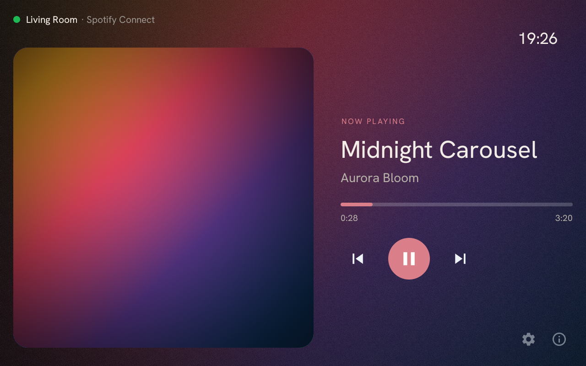
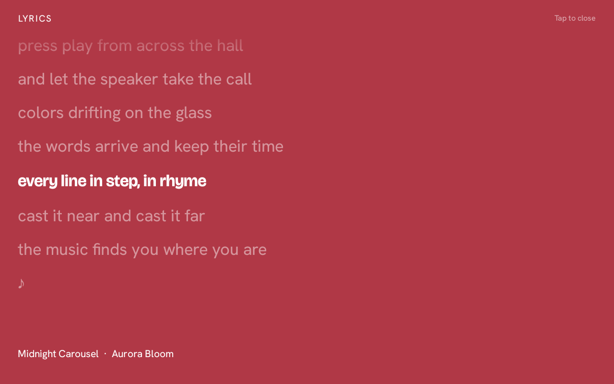
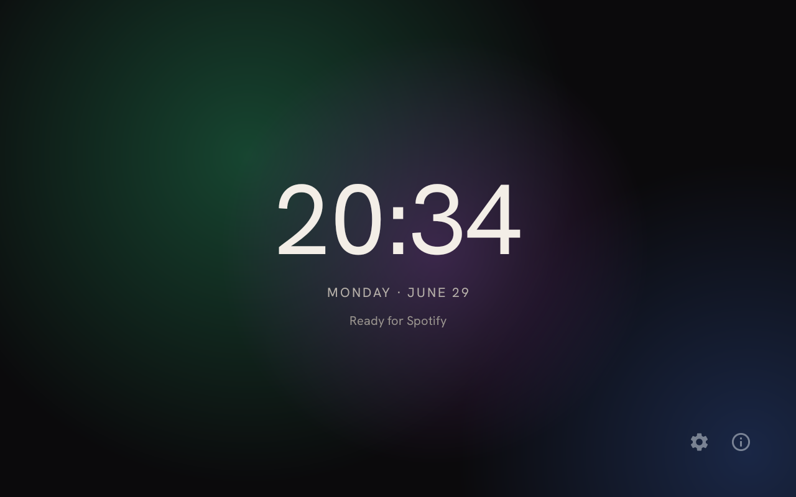
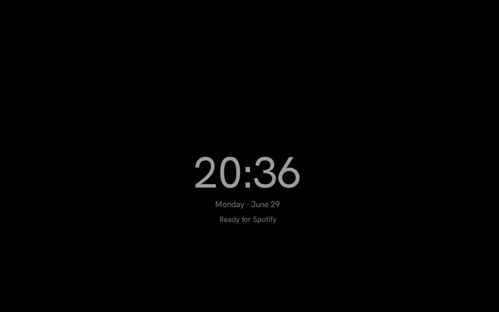
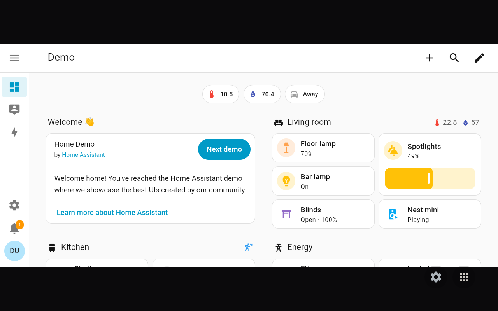
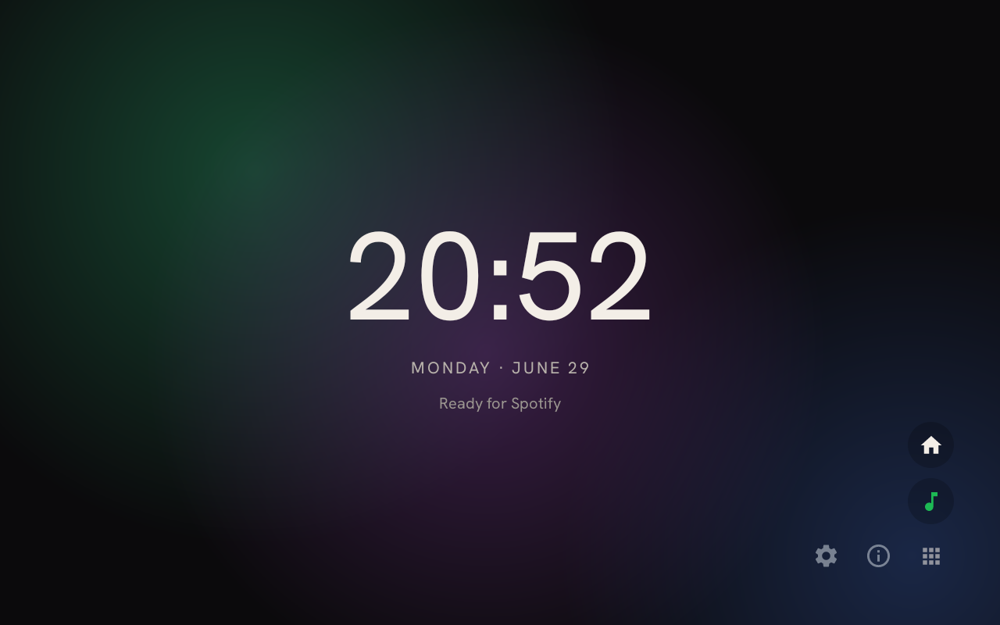
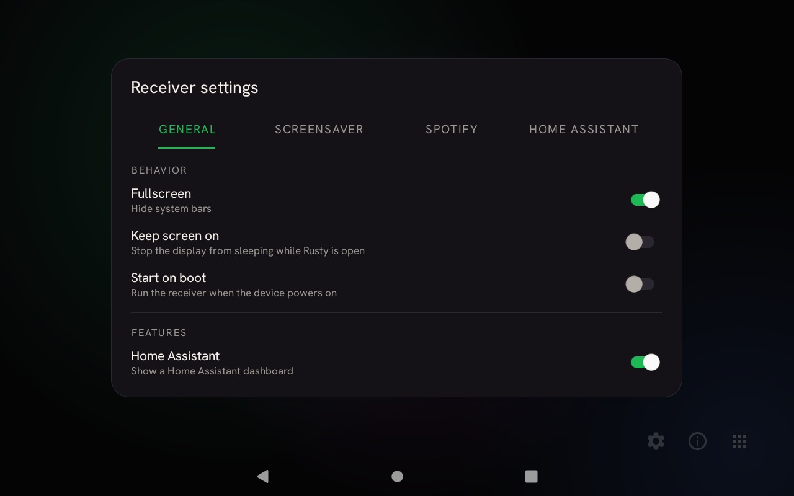
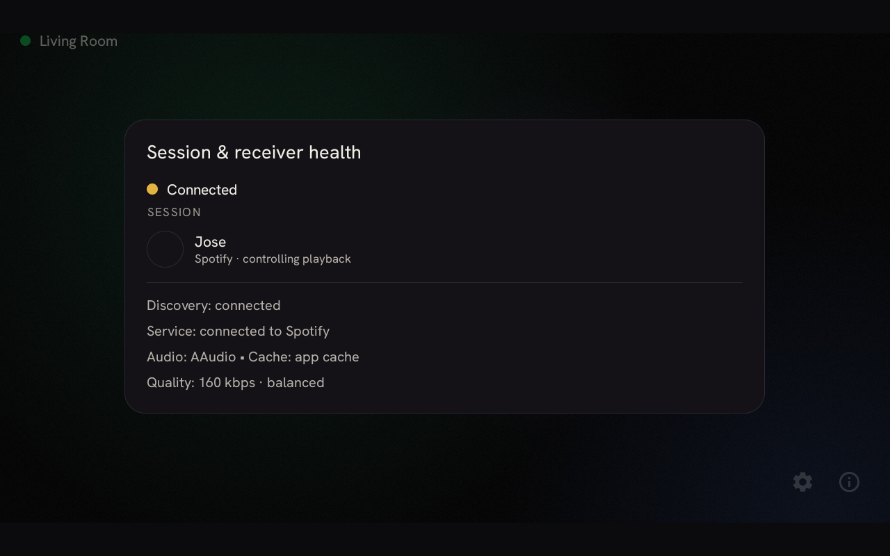

# Rusty

A **Spotify Connect receiver for Android** with an ambient, lyrics-aware now-playing screen —
now grown into a small, always-on **appliance**. Open the app and the device starts advertising
itself on your local network, appearing as a speaker target in any Spotify client (phone,
desktop, web) on the same Wi‑Fi. Pick it, and audio streams directly to the device. When nothing
is playing it settles into a screensaver, and it can double as a full-screen **Home Assistant**
dashboard.

Built on **[Rust](https://www.rust-lang.org/)** — and built to give new life to rusty devices.
Runs great on always-on screens like the Amazon Echo Show, and on any Android 8.0+ device.

<!-- Replace the badge owner/repo if you rename the repository. -->
[](https://github.com/SerafiniJose/rusty/releases/latest)
[](LICENSE)

---

## Screenshots

| Now playing | Synced lyrics | Screensaver · Clock |
| --- | --- | --- |
|  |  |  |

| Screensaver · OLED | Home Assistant | On-screen launcher |
| --- | --- | --- |
|  |  |  |

| Settings | Session & health |
| --- | --- |
|  |  |

> Captured on an Amazon Echo Show 8 (1280×800). Cover art is a generated gradient and the track,
> artist, listener and lyrics are placeholders — no copyrighted content. The Home Assistant shot
> uses the public Home Assistant demo.

---

## Features

- **Spotify Connect target** — zero-config discovery; appears automatically in Spotify clients on the same network.
- **Direct streaming playback** — high-bitrate audio decoded on-device via [librespot](https://github.com/librespot-org/librespot) (Rust), output through cpal's native **AAudio** backend.
- **Follows the active audio route** — output reopens automatically when the route changes (e.g. connecting/disconnecting a Bluetooth speaker or headset mid-playback), so audio moves with it instead of going silent.
- **Ambient now-playing UI** — album-art color wash, drifting mesh background, accent-aware theming, and a calm idle clock face when nothing is playing.
- **Synced lyrics** — time-aligned lyrics that scroll with the track, the active line highlighted.
- **Transport controls** — play / pause / next / previous from the device itself.
- **Live device rename** — change the receiver's broadcast name from Settings; it re-advertises immediately, no restart.
- **Tunable** — pick streaming bitrate (96 / 160 / 320 kbps), a fullscreen "hide system bars" mode, and 12/24-hour clock.
- **Shows your Spotify display name** while connected.
- **Screensaver** — after an idle timeout (or a tap on the clock) Rusty shows a full-screen idle face and gently wakes back to now-playing. Pick a clean **Clock** face, an **OLED**-burn-in-safe drifting face, or a **Canvas** face that plays the track's looping Spotify Canvas video.
- **Home Assistant dashboard** — an optional second screen: sign in once and Rusty shows your Home Assistant dashboards full-screen in a kiosk-style view, with switcher chips to jump between them. It auto-discovers your dashboards and sidebar apps.
- **Spotify Canvas in now-playing** — optionally fill the now-playing screen with the track's looping Canvas video instead of static album art.
- **On-screen launcher** — an expandable button jumps between Spotify, Home Assistant, and the screensaver.
- **Start on boot & Keep screen on** — optional toggles to launch Rusty when the device powers on and to hold the display awake while it's in front.
- **Tabbed settings** — each feature gets its own settings page.

## Requirements

- **Spotify Premium** — Spotify Connect requires a Premium account.
- **Android 8.0 (API 26) or newer.**
- A **64-bit (arm64-v8a)** or **32-bit ARM (armeabi-v7a)** device. (No x86 builds are shipped.)
- The receiver and the controlling Spotify client must be on the **same local network**.
- **Home Assistant mode (optional)** needs a Home Assistant instance reachable on the same local network.

> Tested on an Amazon Echo Show 8 running LineageOS 18.1 (Android 11) and on a Lenovo Tab M10 (TB-X606FA).

## Install

1. Go to the [**Releases**](https://github.com/SerafiniJose/rusty/releases/latest) page.
2. Download the `.apk` for the latest release (e.g. `rusty-v2.0.0.apk`).
3. Sideload it onto your device:
   ```bash
   adb install -r rusty-v2.0.0.apk
   ```
   (Or enable "Install unknown apps" and open the APK directly on the device.)
4. Launch the app — it begins advertising as a Connect target right away.

> The published APK is **debug-signed** (built with `assembleDebug`). It installs and runs fine for
> sideloading; if you later switch to a release-signed build, uninstall first to avoid a signature
> conflict on upgrade.

## Build from source

**Toolchain:** JDK 17, Android SDK (compileSdk 36), Gradle 8.13 (via the wrapper), AGP 8.13.2, Kotlin 2.0.21.

```bash
git clone https://github.com/SerafiniJose/rusty.git
cd rusty
./gradlew assembleDebug          # → app/build/outputs/apk/debug/app-debug.apk
```

The Android build consumes **prebuilt native libraries** committed under
`app/src/main/jniLibs/{arm64-v8a,armeabi-v7a}/libspotify_receiver_core.so`, so you do **not**
need the Rust toolchain to build the APK.

### Rebuilding the native core (only when Rust changes)

The native core lives in [`rust/`](rust/). It cross-compiles with
[`cargo-ndk`](https://github.com/bbqsrc/cargo-ndk), which writes the refreshed `.so`
files straight into `jniLibs` for both ABIs:

```bash
cargo install cargo-ndk                                    # one-time
rustup target add aarch64-linux-android armv7-linux-androideabi
export ANDROID_NDK_HOME=/path/to/ndk                       # NDK r27+

cd rust
cargo ndk -t armeabi-v7a -t arm64-v8a --platform 26 \
  -o ../app/src/main/jniLibs build --release
```

> **`--platform 26` is required.** The audio path is cpal's AAudio backend, which
> links `libaaudio.so` — and the NDK ships that library only for API ≥ 26 (which is
> also the app's `minSdk`). Omitting it fails to link with `unable to find library -laaudio`.

> The JNI symbol names (`Java_dev_rusty_app_NativeBridge_*`) are derived from the
> app package. If you ever change the package, the native symbols must be regenerated to match.

## How it works

```
Spotify client ──Connect/zeroconf──▶  Rusty — a feature shell (Kotlin · HomeActivity)
(same network)                           ├─ Spotify         now playing · lyrics · idle
                                         ├─ Screensaver     Clock / OLED / Canvas
                                         └─ Home Assistant  kiosk WebView → your HA instance
                                              │  JNI  (Spotify feature)
                                              ▼
                                   Rust core (librespot 0.8)
                                   session · player · audio backend
```

- The app is a small **feature shell** (`HomeActivity`) that hosts switchable, full-screen
  features — the **Spotify** receiver, the **screensaver**, and **Home Assistant** — under one
  shared chrome (clock, settings, on-screen launcher).
- **Kotlin** (`app/`) handles the UI, the foreground service, network advertising, and the
  now-playing / lyrics / settings / screensaver screens. Home Assistant is a kiosk **WebView**
  pointed at your own instance — no Rust involved.
- **Rust** (`rust/`) wraps [librespot](https://github.com/librespot-org/librespot) 0.8 and exposes
  a small JNI surface (`NativeBridge`) for session lifecycle, transport, token retrieval, and
  rename — used only by the Spotify feature.

## Credits & attribution

- Built on **[librespot](https://github.com/librespot-org/librespot)** (MIT) — the open-source
  Spotify client library that does the real protocol and audio work.
- Originally inspired by **[willturr/librespot-android-connect](https://github.com/willturr/librespot-android-connect)**,
  a proof-of-concept that demonstrated driving librespot from Android over JNI.
- Home Assistant dashboard icons are rendered with the **[Material Design Icons](https://pictogrammers.com/library/mdi/)**
  webfont by the [Pictogrammers](https://pictogrammers.com/) group (fonts under the Apache 2.0 license).
- The **Home Assistant** screen embeds your own [Home Assistant](https://www.home-assistant.io/)
  instance (an open-source home-automation platform; this project is not affiliated with it).

## Disclaimer

This is an unofficial, independent project. It is **not** affiliated with, authorized, or endorsed
by Spotify. "Spotify" is a trademark of Spotify AB. You need your own Spotify Premium account to use
it, and you are responsible for complying with Spotify's Terms of Service. Provided as-is, for
personal and educational use.

## License

Everything in this repository is licensed under the MIT license.
