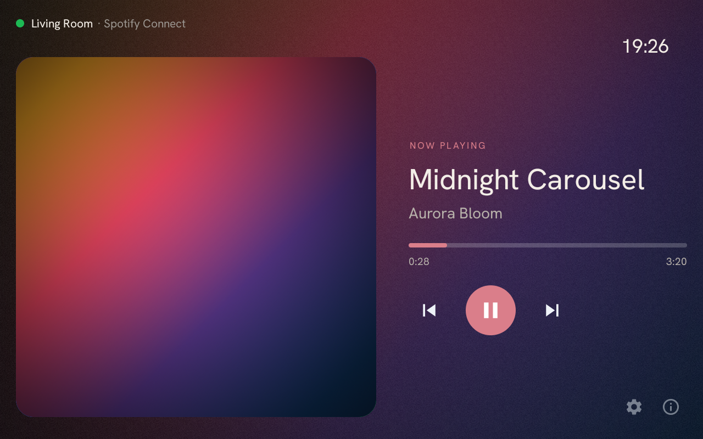
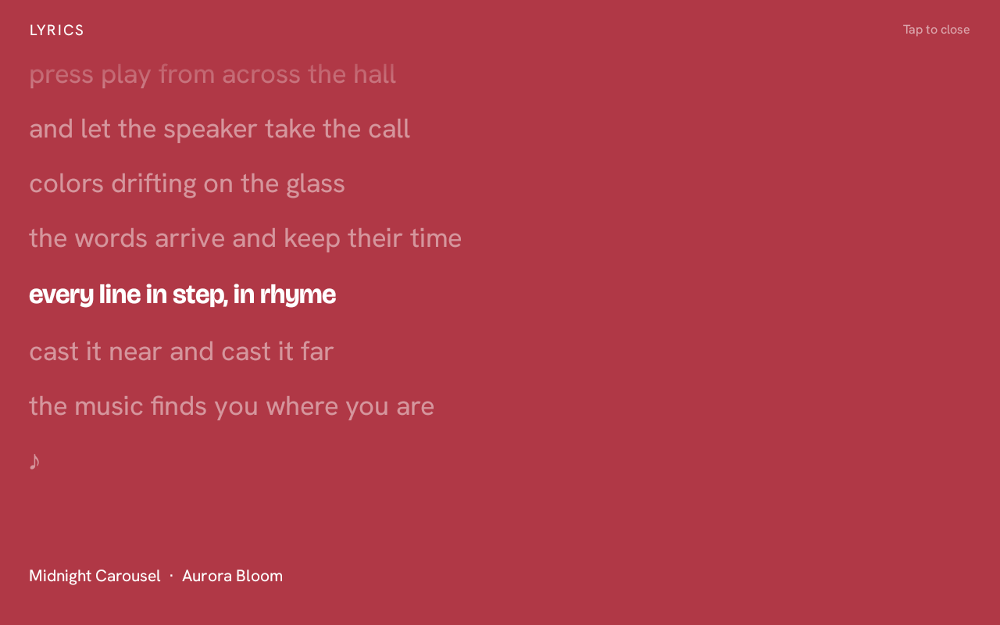
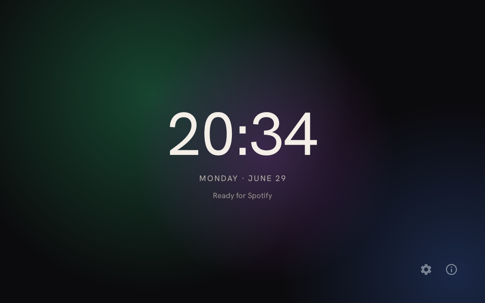
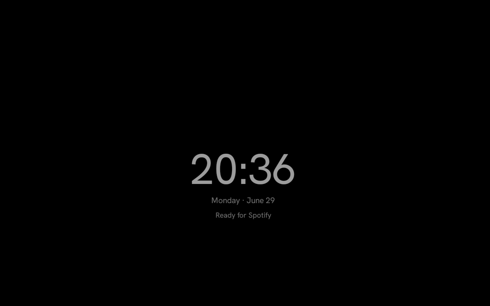
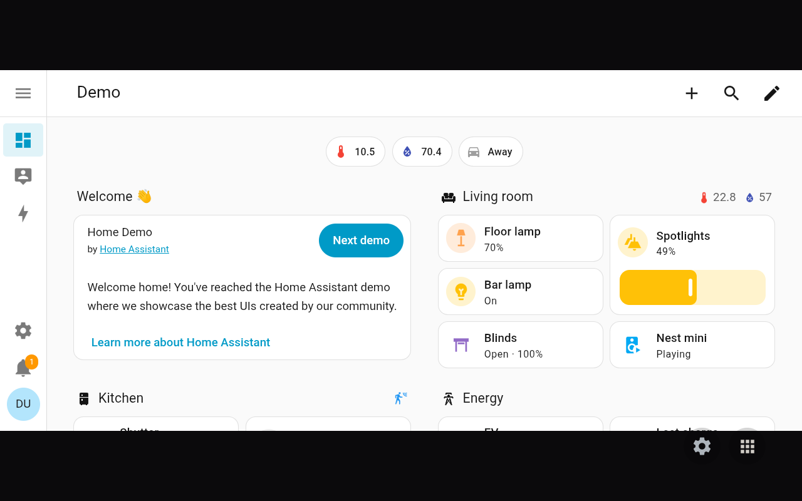
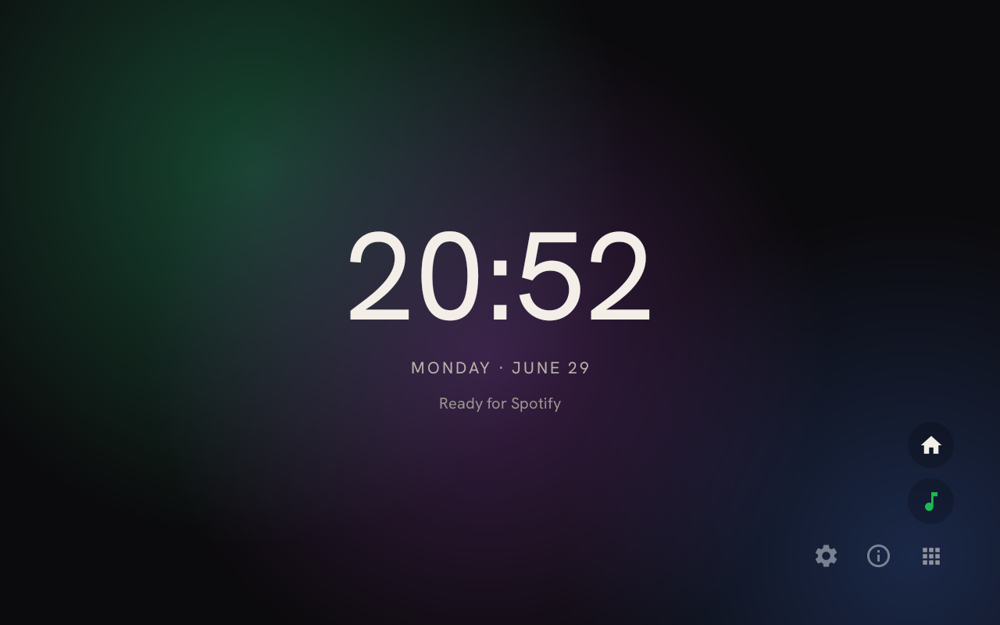
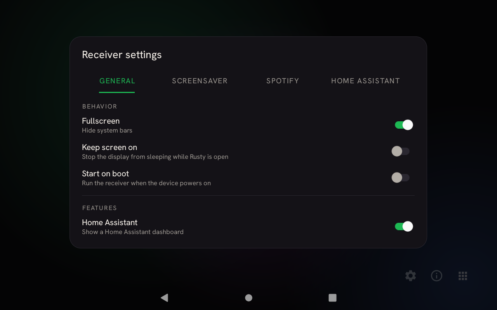
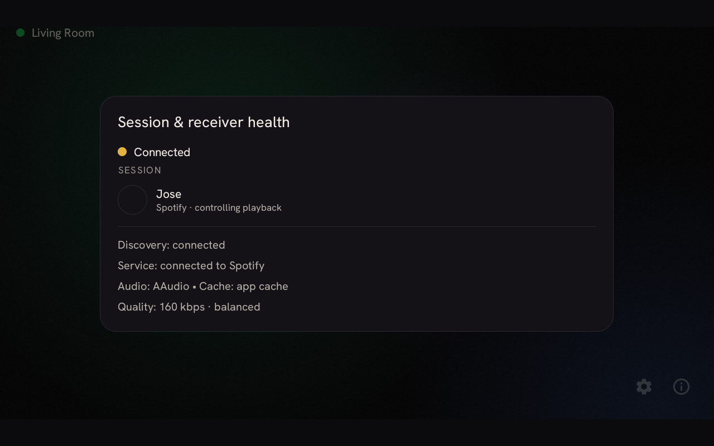
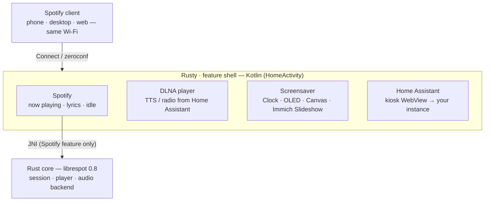

# Rusty

A **Spotify Connect receiver for Android** with an ambient, lyrics-aware now-playing screen —
now grown into a small, always-on **appliance**. Open the app and the device starts advertising
itself on your local network, appearing as a speaker target in any Spotify client (phone,
desktop, web) on the same Wi‑Fi. Pick it, and audio streams directly to the device. When nothing
is playing it settles into a screensaver, and it can double as a full-screen **Home Assistant**
dashboard.

Built on **[Rust](https://www.rust-lang.org/)** — and built to give new life to rusty devices.
Runs great on always-on screens like the Amazon Echo Show, and on any Android 8.0+ device.

<!-- Replace the badge owner/repo if you rename the repository. -->
[](https://github.com/SerafiniJose/rusty/releases/latest)
[](LICENSE)

---

## Showcase

https://github.com/user-attachments/assets/973e78b3-98b2-4a9f-96a5-fc913f78ac96

---

## Screenshots

| Now playing | Synced lyrics | Screensaver · Clock |
| --- | --- | --- |
|  |  |  |

| Screensaver · OLED | Home Assistant | On-screen launcher |
| --- | --- | --- |
|  |  |  |

| Settings | Session & health |
| --- | --- |
|  |  |

> Captured on an Amazon Echo Show 8 (1280×800). Cover art is a generated gradient and the track,
> artist, listener and lyrics are placeholders — no copyrighted content. The Home Assistant shot
> uses the public Home Assistant demo.

---

## Features

- **Spotify Connect target** — zero-config discovery; appears automatically in Spotify clients on the same network.
- **Direct streaming playback** — high-bitrate audio decoded on-device via [librespot](https://github.com/librespot-org/librespot) (Rust), output through cpal's native **AAudio** backend.
- **Follows the active audio route** — output reopens automatically when the route changes (e.g. connecting/disconnecting a Bluetooth speaker or headset mid-playback), so audio moves with it instead of going silent.
- **Ambient now-playing UI** — album-art color wash, drifting mesh background, accent-aware theming, and a calm idle clock face when nothing is playing.
- **Synced lyrics** — time-aligned lyrics that scroll with the track, the active line highlighted.
- **Transport controls** — play / pause / next / previous from the device itself.
- **Live device rename** — change the receiver's broadcast name from Settings; it re-advertises immediately, no restart.
- **Tunable** — pick streaming bitrate (96 / 160 / 320 kbps), a fullscreen "hide system bars" mode, and 12/24-hour clock.
- **Shows your Spotify display name** while connected.
- **Screensaver** — after an idle timeout (or a tap on the clock) Rusty shows a full-screen idle face and gently wakes back to now-playing. Pick a clean **Clock** face, an **OLED**-burn-in-safe drifting face, a **Spotify Canvas** face that plays the track's looping Canvas video, or an **Immich Slideshow** face.
- **Immich Slideshow** — turn the idle screen into your own photo frame: point Rusty at a self-hosted [Immich](https://immich.app) server and it shows your library, or just the albums, people or tags you pick, with slow Ken Burns motion, a blurred fill, an optional clock and photo info, and pause / next / previous from the screen or a remote. The key it needs is read-only — see [Immich API key permissions](#immich-api-key-permissions).
- **Home Assistant dashboard** — an optional second screen: sign in from Rusty's settings (or through the dashboard's own login) and Rusty shows your Home Assistant dashboards full-screen in a kiosk-style view, with switcher chips to jump between them. It auto-discovers your dashboards and sidebar apps, and can tint its own chrome to match your dashboard theme.
- **Home Assistant media renderer** — optionally expose Rusty as a DLNA media player that Home Assistant auto-discovers as a `media_player` entity (nothing to install on the HA side). Speak TTS announcements ("the wash is done", a doorbell chime, a morning briefing) or stream internet radio to it from automations, scripts, or a dashboard card — Rusty pauses or fades Spotify while the message plays and resumes it afterwards.
- **Spotify Canvas in now-playing** — optionally fill the now-playing screen with the track's looping Canvas video instead of static album art.
- **Remote control** — an optional, off-by-default web page and HTTP API the device serves itself: turn the screen on/off, set brightness and media volume, see what's playing, and edit the Slideshow's album/person/tag filters from your phone or laptop. While it's on, the device announces itself on the network so a Home Assistant integration can discover it. See [Remote control](#remote-control).
- **Playback takeover** — optionally have Rusty react when a phone or laptop starts playing on this receiver: switch the app to the Spotify page, bring it to the front over other apps, and/or wake the screen. Three independent toggles in **Settings → Spotify**, all off by default. See [Playback takeover](#playback-takeover).
- **On-screen launcher** — an expandable button jumps between Spotify, Home Assistant, and the screensaver.
- **Start on boot & Keep screen on** — optional toggles to launch Rusty when the device powers on and to hold the display awake while it's in front.
- **Tabbed settings** — each feature gets its own settings page.

## Requirements

- **Spotify Premium** — Spotify Connect requires a Premium account.
- **Android 8.0 (API 26) or newer.**
- A **64-bit (arm64-v8a)** or **32-bit ARM (armeabi-v7a)** device. (No x86 builds are shipped.)
- The receiver and the controlling Spotify client must be on the **same local network**.
- **Home Assistant mode (optional)** needs a Home Assistant instance reachable on the same local network.
- **Immich Slideshow (optional)** needs a self-hosted [Immich](https://immich.app) server reachable on the same local network, plus an API key (see below).
- **Remote control (optional)** is off by default and needs nothing but a browser on the same local network — read the [security note](#security--please-read-before-enabling) before enabling it.

> Tested on an Amazon Echo Show 8 running LineageOS 18.1 (Android 11) and on a Lenovo Tab M10 (TB-X606FA).

### Immich API key permissions

Create the key in Immich under **Account settings → API keys**, and grant it these
read permissions:

```
album.read
album.statistics
asset.view
asset.read
asset.statistics
face.read
memory.read
person.read
person.statistics
tag.read
user.read
```

## Remote control

Rusty can serve a small control page — and the HTTP API behind it — from the device itself, so
you can drive the screen from another room without walking over to it.

**It is off by default.** Turn it on in **Settings → General → Remote control**. The same row
then shows the address to open, something like `http://192.168.1.42:8765/`. Type that into any
browser on the same network and you get a single page with:

- **Screen** — on/off and a brightness slider. "Off" is a full-screen black overlay that keeps
  the panel awake, so turning it back on is instant; touching the device (or pressing any remote
  key) also wakes it.
- **Volume** — the media volume slider. Hidden on devices whose volume is fixed (some TVs and
  docks).
- **Playing** — whether the Spotify receiver or the DLNA player is currently playing.
- **Slideshow filters** — the same album / person / tag checklists as the in-app picker, so you
  can re-aim the photo frame from the sofa.

The port is fixed at **8765**. Nothing needs to be installed on the other device — it's one
self-contained page, no accounts, no cloud.

### The "Allow system brightness" row

Under the toggle you may see a row asking to allow system brightness. It opens Android's **Modify
system settings** screen for Rusty. Granting it lets the brightness slider move the **device's
real display brightness**; without it, Rusty can only dim its own window, which looks the same
from across the room but doesn't affect anything else on screen. The control page tells you which
mode is in effect. It is entirely optional, and Remote control works without it.

### Home Assistant

While Remote control is on, Rusty advertises itself as `_rusty._tcp` over mDNS so a Home
Assistant integration can discover it on the network and expose the screen, volume and playing
state as entities. That integration is a separate project; Rusty itself needs no configuration
for it beyond the toggle.

### Security — please read before enabling

There is **no password, PIN or token** on this API. That is a deliberate choice for a device that
lives on a home network, and it means:

- **Any client on your local network can control this device**: switch the screen on or off,
  change brightness and media volume, and change the Slideshow filters. It can also **read the
  names of your Immich albums, people and tags** (names only — no photos are served through this
  API, and your Immich API key never leaves the device).
- **Any app already installed on the device** that holds the `INTERNET` permission can do the
  same, because `localhost`/`127.0.0.1` are deliberately accepted as valid hosts (that is what
  makes `adb forward` debugging work). This isn't a new class of exposure — a local app could
  already reach any server on the LAN — but it is worth knowing.
- Browser-based attacks are guarded against: Rusty validates the `Host` header (so a page on the
  public internet can't use DNS rebinding to reach it), never emits CORS headers, requires
  `Content-Type: application/json` on writes, and serves nothing but the one embedded page and
  the fixed API routes.

So: leave it off unless you want it, and don't enable it on a network you don't trust — a guest
Wi-Fi, a shared flat, a café. If you need it reachable from outside your home, put it behind your
own VPN rather than forwarding port 8765.

### Playback takeover

**Settings → Spotify** has three independent toggles, each off by default: **Switch to Spotify on
playback**, **Bring app to front on playback**, and **Wake screen on playback**. All three react
only to a genuine new play started from another device — renaming the receiver, changing bitrate,
or a plain pause/resume won't trigger them.

**Bring app to front** needs Android's **Display over other apps** permission
(`SYSTEM_ALERT_WINDOW`). Its settings row opens the system grant screen directly; on devices that
ship no such screen — common on Android TV and Fire OS builds — the toggle disables itself with an
explanation instead.

Holding that permission is a documented background-activity-launch exemption on Android 10–15, but
Android 14–16 have progressively hardened background launches, and some OEM builds ignore the
exemption regardless. A blocked launch is swallowed silently by the platform — there is no way for
Rusty to detect it — so on an affected device the toggle quietly degrades to the same page switch
as the first toggle: the Spotify page is simply ready and waiting the next time you open the app,
and the existing media notification remains the manual way to bring it forward.

## Install

1. Go to the [**Releases**](https://github.com/SerafiniJose/rusty/releases/latest) page.
2. Download the `.apk` for the latest release (e.g. `rusty-v2.0.0.apk`).
3. Sideload it onto your device:
   ```bash
   adb install -r rusty-v2.0.0.apk
   ```
   (Or enable "Install unknown apps" and open the APK directly on the device.)
4. Launch the app — it begins advertising as a Connect target right away.

> The published APK is **debug-signed** (built with `assembleDebug`). It installs and runs fine for
> sideloading; if you later switch to a release-signed build, uninstall first to avoid a signature
> conflict on upgrade.

## Build from source

**Toolchain:** JDK 17, Android SDK (compileSdk 36), Gradle 8.13 (via the wrapper), AGP 8.13.2, Kotlin 2.0.21.

```bash
git clone https://github.com/SerafiniJose/rusty.git
cd rusty
./gradlew assembleDebug          # → app/build/outputs/apk/debug/app-debug.apk
```

The Android build consumes **prebuilt native libraries** committed under
`app/src/main/jniLibs/{arm64-v8a,armeabi-v7a}/libspotify_receiver_core.so`, so you do **not**
need the Rust toolchain to build the APK.

### Rebuilding the native core (only when Rust changes)

The native core lives in [`rust/`](rust/). It cross-compiles with
[`cargo-ndk`](https://github.com/bbqsrc/cargo-ndk), which writes the refreshed `.so`
files straight into `jniLibs` for both ABIs:

```bash
cargo install cargo-ndk                                    # one-time
rustup target add aarch64-linux-android armv7-linux-androideabi
export ANDROID_NDK_HOME=/path/to/ndk                       # NDK r27+

cd rust
cargo ndk -t armeabi-v7a -t arm64-v8a --platform 26 \
  -o ../app/src/main/jniLibs build --release
```

> **`--platform 26` is required.** The audio path is cpal's AAudio backend, which
> links `libaaudio.so` — and the NDK ships that library only for API ≥ 26 (which is
> also the app's `minSdk`). Omitting it fails to link with `unable to find library -laaudio`.

> The JNI symbol names (`Java_dev_rusty_app_NativeBridge_*`) are derived from the
> app package. If you ever change the package, the native symbols must be regenerated to match.

## How it works


```mermaid
flowchart TD
    client["Spotify client<br/>phone · desktop · web — same Wi-Fi"]
    client -- "Connect / zeroconf" --> shell

    subgraph shell["Rusty · feature shell — Kotlin (HomeActivity)"]
        direction LR
        spotify["Spotify<br/>now playing · lyrics · idle"]
        dlna["DLNA player<br/>TTS / radio from Home Assistant"]
        screensaver["Screensaver<br/>Clock · OLED · Canvas · Immich Slideshow"]
        homeassistant["Home Assistant<br/>kiosk WebView → your instance"]
    end

    spotify -- "JNI (Spotify feature only)" --> core["Rust core — librespot 0.8<br/>session · player · audio backend"]
```

- The app is a small **feature shell** (`HomeActivity`) that hosts switchable, full-screen
  features — the **Spotify** receiver, the **screensaver**, and **Home Assistant** — under one
  shared chrome (clock, settings, on-screen launcher).
- **Kotlin** (`app/`) handles the UI, the foreground service, network advertising, and the
  now-playing / lyrics / settings / screensaver screens. Home Assistant is a kiosk **WebView**
  pointed at your own instance — no Rust involved.
- **Rust** (`rust/`) wraps [librespot](https://github.com/librespot-org/librespot) 0.8 and exposes
  a small JNI surface (`NativeBridge`) for session lifecycle, transport, token retrieval, and
  rename — used only by the Spotify feature.

## Credits & attribution

- Built on **[librespot](https://github.com/librespot-org/librespot)** (MIT) — the open-source
  Spotify client library that does the real protocol and audio work.
- Originally inspired by **[willturr/librespot-android-connect](https://github.com/willturr/librespot-android-connect)**,
  a proof-of-concept that demonstrated driving librespot from Android over JNI.
- Home Assistant dashboard icons are rendered with the **[Material Design Icons](https://pictogrammers.com/library/mdi/)**
  webfont by the [Pictogrammers](https://pictogrammers.com/) group (fonts under the Apache 2.0 license).
- The **Home Assistant** screen embeds your own [Home Assistant](https://www.home-assistant.io/)
  instance (an open-source home-automation platform; this project is not affiliated with it).
- The **Immich Slideshow** connects to your own self-hosted **[Immich](https://immich.app)** server
  ([source](https://github.com/immich-app/immich)) — an open-source, self-hosted photo and video
  library. Rusty reads your photos through Immich's API with a read-only key and bundles none of its
  code; this project is not affiliated with it.

## Disclaimer

This is an unofficial, independent project. It is **not** affiliated with, authorized, or endorsed
by Spotify. "Spotify" is a trademark of Spotify AB. You need your own Spotify Premium account to use
it, and you are responsible for complying with Spotify's Terms of Service. Provided as-is, for
personal and educational use.

## License

Everything in this repository is licensed under the MIT license.
