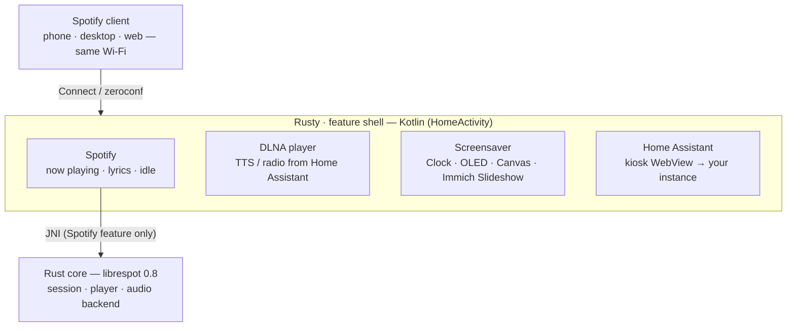

# How it works

- The app is a small **feature shell** (`HomeActivity`) that hosts switchable, full-screen
  features — the **Spotify** receiver, the **screensaver**, and **Home Assistant** — under one
  shared chrome (clock, settings, on-screen launcher).
- **Kotlin** (`app/`) handles the UI, the foreground service, network advertising, and the
  now-playing / lyrics / settings / screensaver screens. Home Assistant is a kiosk **WebView**
  pointed at your own instance — no Rust involved.
- **Rust** (`rust/`) wraps [librespot](https://github.com/librespot-org/librespot) 0.8 and exposes
  a small JNI surface (`NativeBridge`) for session lifecycle, transport, token retrieval, and
  rename — used only by the Spotify feature.

---

[← Back to the README](../README.md)
